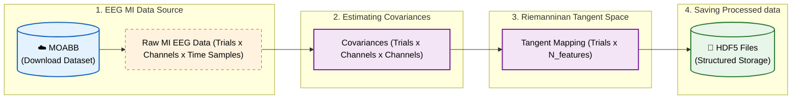
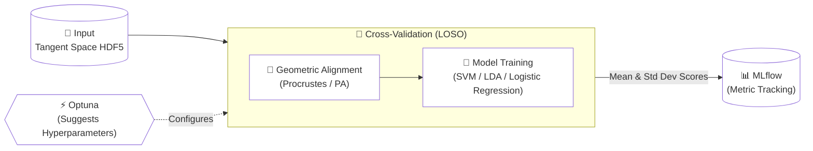

# <center> **🧠 Riemannian BCI Benchmark Pipeline**

A high-performance research pipeline for Motor Imagery (MI) classification, designed to benchmark and validate Riemannian Geometry algorithms in Brain-Computer Interfaces (BCI). 

The pipeline features an automated "Research Engine" that orchestrates **Hyperparameter Optimization (Optuna)** and **Model Observability (MLflow)**, ensuring rigorous validation via **Leave-One-Subject-Out (LOSO)** cross-validation.

## 1. Key Points

* **Data-Driven Benchmarking:** The pipeline operates on pre-processed Tangent Space data stored in standardized HDF5 files. This allows the Python training pipeline to be agnostic to the processing backend, seamlessly consuming data whether it was processed by PyRiemann (Python) or generated externally by any other libary.
* **Language-Agnostic Integration:** This pipeline is designed to be extensible. If you wish to use a custom processing library developed in another programming language (e.g., C++, Rust, MATLAB), simply ensure your output `.h5` files adhere to the HDF5 Data Schema defined in `docs/data_interface.md`. By strictly following this data contract, specifically the dataset structure and data type metadata, this pipeline can seamlessly ingest, validate, and benchmark your external data against standard Python implementations without any code modifications.
* **Geometric Domain Adaptation:** Implements **Procrustes Alignment (PA)**. It aligns the centroids of class clusters (Transfer Learning) to map new subjects into the training manifold.
* **Cross-Validation:** Utilizes **Leave-One-Subject-Out (LOSO)** cross-validation. For a dataset of $N$ subjects, models are trained $N$ times to strictly evaluate generalization to unseen users.
* **Automated Orchestration:** An intelligent orchestrator manages **Optuna** studies to find the optimal hyperparameters for SVM, LDA and Logistic Regression models. Other models can be integrated.
* **Full Observability:** Deep MLflow integration tracking metrics (Macro F1-Score, Accuracy), artifacts (UMAP/PCA visualizations), and full model parameter traceability.

### Pipeline Diagram

#### Pipeline Download & Processing



#### Pipeline Training & Hyperparametrization Search



## 2. Project Structure

```
.
├── data/
│   ├── raw/                        # Raw EEG data downloaded from MOABB (HDF5)
│   ├── processed/                  # Tangent Space HDF5 (PyRiemann Output)
|   ├── riemanndsp/                 # Tangent Space HDF5 (RiemannDSP External Output)
│   └── optuna_db/                  # Centralized SQLite metadata
├── examples/                       # Examples
│   ├── 01_Download_Data.py
│   ├── 02_Processing_Data.py
│   └── 03_Benchmark_Examples.py
├── scripts/                        # ETL Pipelines
│   ├── export_results.py           # Export results from MLflow into .csv
│   ├── get_data.py                 # Download Raw Data (MOABB) -> Save to HDF5
│   ├── process_data.py         # Raw HDF5 -> PyRiemann -> Covariances and Tangent Space HDF5
├── src/pipe_bci_toolkit/       # Core Library Code
│   ├── core/                   # Core Classes
│   ├── data/                   # HDF5 Data Managers (Read/Write)
│   ├── models/                 # Model Wrappers (SVM, LDA, etc.)
|   ├── processing/             # Data Transformation pipeline
│   ├── tracking/               # MLflow & Optuna Orchestration Logic
├── docs/                       # Documentation
├── .gitignore
├── pyproject.toml              # Dependency Management (uv)
└── README.md
```

## **3. Installation**

This project uses uv for fast and reproducible dependency management.

Prerequisites: Python 3.10+

### 3.1. Install Library

### 3.1.1 Install from local folder
```
# Using uv:
uv pip install -e /path/to/eeg-pyriemann-pipeline

# OR using standard pip:
pip install -e /path/to/eeg-pyriemann-pipeline
```

### 3.1.2 Install from github
```
# Using uv:
uv pip install git+https://github.com/CommanderErika/eeg-pyriemann-pipeline.git
# Or
uv pip install --no-cache --force-reinstall git+https://github.com/CommanderErika/eeg-pyriemann-pipeline.git

# OR using standard pip:
pip install git+https://github.com/CommanderErika/eeg-pyriemann-pipeline.git
```

## **4. Usage Workflow**

With the environment activated and the library installed globally, you can follow the sequential examples to run your first benchmark.

### **4.1. Download Data & ETL**

The pipeline uses HDF5 as the common interface for data exchange. We provide step-by-step examples to get you started:

```
# Step 1: Download datasets (e.g., Cho2017) from MOABB to /data/raw
python examples/01_Download_Data.py

# Step 2: Calculate Covariance and Tangent Space using PyRiemann to /data/processed
python examples/02_Processing_Data.py
```


### **4.2. Observability Server**
Launch MLflow to visualize experiment results in real-time. Dashboard available at: http://127.0.0.1:8080.

```
# Bash
uv run mlflow ui --host 127.0.0.1 --port 8080
```

### **4.3. Running Benchmarks**
Execute the experiment scripts. Each script points to a specific processed data path. Since both PyRiemann and RiemannDSP outputs share the same HDF5 schema, the training orchestrator processes them identically.

```
# Step 3: Run the Hyperparameter Optimization / Benchmark loop
python examples/03_Benchmark_Examples.py
```
